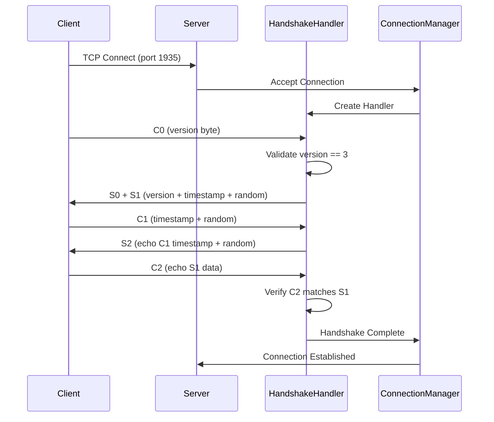
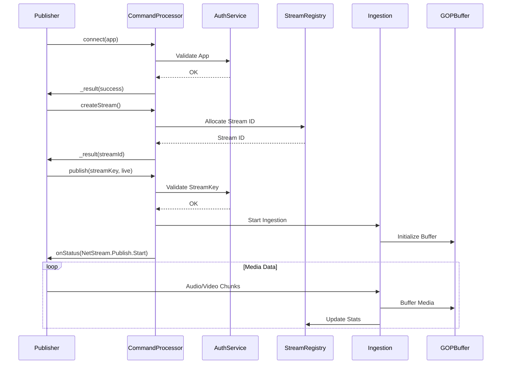
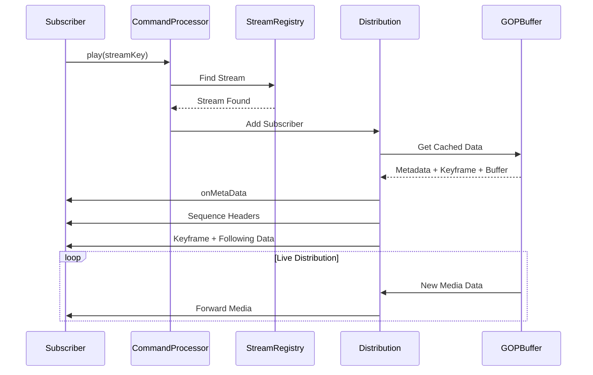
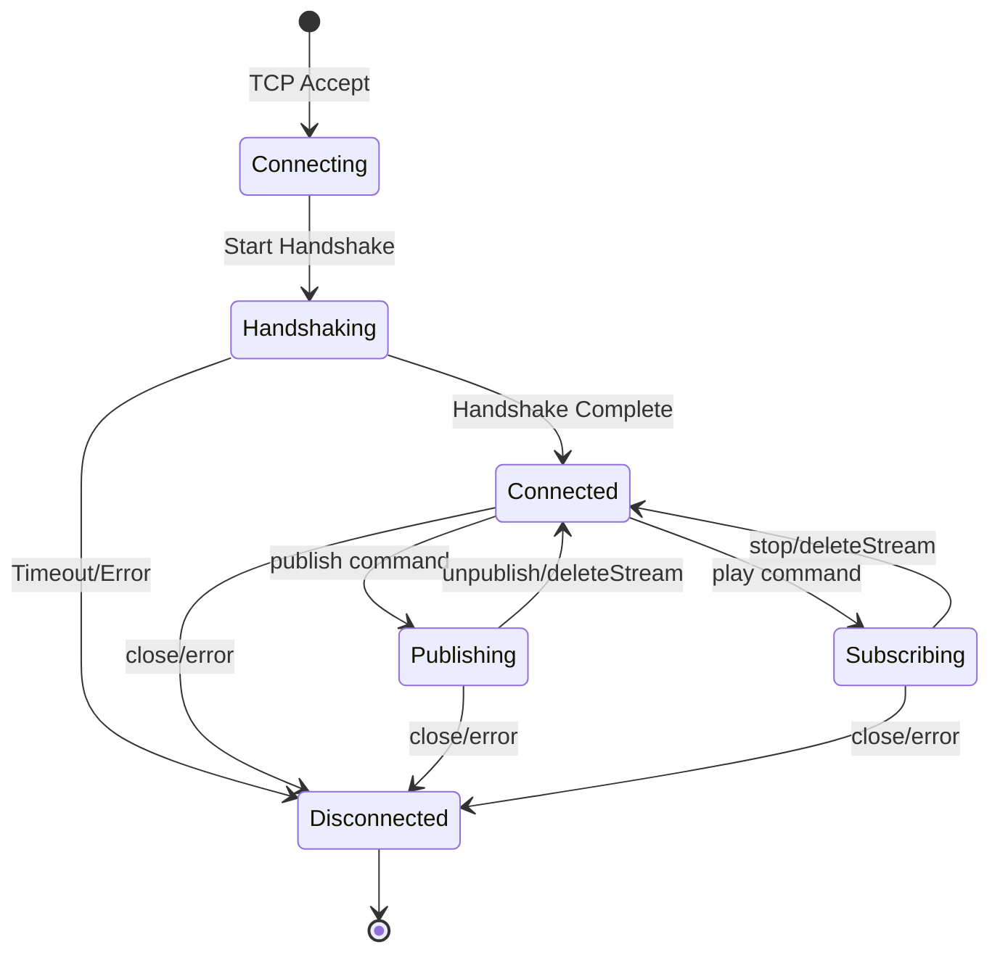
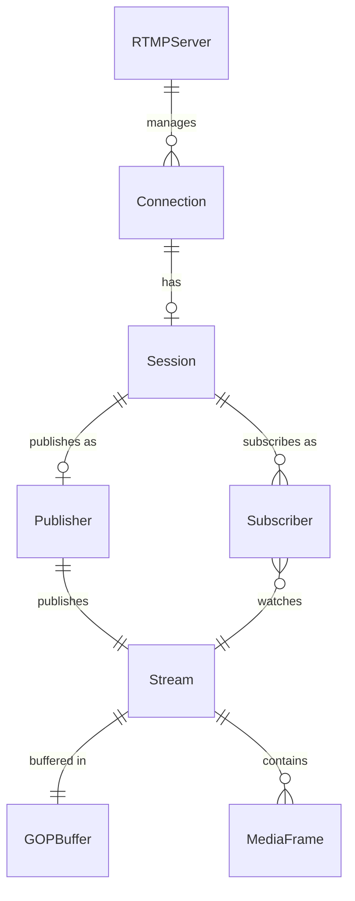
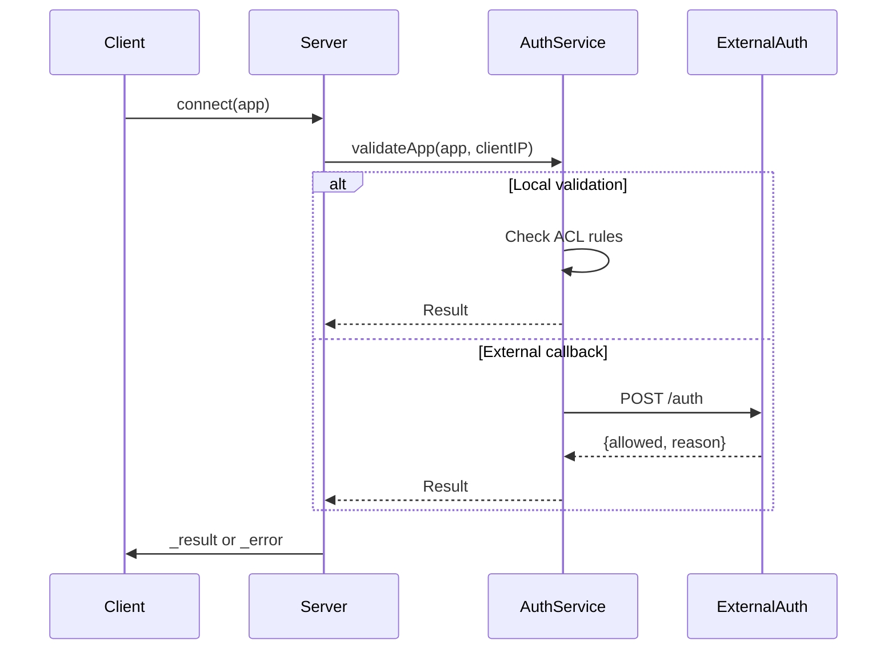

# Design Document

## Overview

**Purpose**: OpenRTMP delivers a cross-platform RTMP server library that enables live video stream ingestion from encoders and broadcasters, with real-time distribution to connected subscribers. The server runs natively on desktop platforms (macOS, Windows 11, Linux) and mobile platforms (iOS, iPadOS, Android).

**Users**:
- Application developers embedding RTMP server functionality into desktop and mobile applications
- Content creators requiring local or LAN-based streaming infrastructure
- System administrators deploying lightweight streaming servers

**Impact**: Creates a new embeddable RTMP server with unified API surface across six platforms, abstracting platform-specific networking, threading, and I/O behind consistent interfaces.

### Goals
- Implement complete RTMP handshake and message protocol per Adobe specification
- Support Enhanced RTMP (E-RTMP) for H.265/HEVC codec via FourCC signaling
- Achieve sub-2-second latency on desktop, sub-3-second on mobile
- Support 1000+ concurrent connections on desktop, 100+ on mobile
- Provide unified C++ API with platform-specific build targets

### Non-Goals
- WebRTC or HLS/DASH protocol conversion (future consideration)
- Cloud-native orchestration or Kubernetes integration
- Video transcoding or adaptive bitrate encoding
- Built-in CDN or edge caching functionality
- GUI management interface

## Architecture

### Architecture Pattern & Boundary Map

**Selected Pattern**: Layered Architecture with Platform Abstraction Layer (PAL)

**Rationale**: A layered architecture isolates platform-specific implementations from protocol logic, enabling parallel development of platform backends while maintaining a single RTMP protocol implementation. The PAL pattern is industry-standard for cross-platform C++ libraries and aligns with patterns used by libuv, SDL, and POCO.

```mermaid
graph TB
    subgraph PublicAPI[Public API Layer]
        ServerAPI[RTMPServer API]
        ConfigAPI[Configuration API]
        MetricsAPI[Metrics API]
    end

    subgraph Protocol[RTMP Protocol Layer]
        Handshake[Handshake Handler]
        ChunkParser[Chunk Parser]
        MessageAssembler[Message Assembler]
        CommandProcessor[Command Processor]
    end

    subgraph Streaming[Stream Management Layer]
        StreamRegistry[Stream Registry]
        Ingestion[Ingestion Pipeline]
        Distribution[Distribution Engine]
        GOPBuffer[GOP Buffer]
    end

    subgraph Core[Core Services Layer]
        ConnectionManager[Connection Manager]
        SessionManager[Session Manager]
        AuthService[Authentication Service]
        TLSService[TLS Service]
    end

    subgraph PAL[Platform Abstraction Layer]
        NetworkPAL[Network Abstraction]
        ThreadPAL[Thread Abstraction]
        TimerPAL[Timer Abstraction]
        FilePAL[File I/O Abstraction]
        LogPAL[Logging Abstraction]
    end

    subgraph Platform[Platform Implementations]
        macOS[macOS - kqueue]
        Windows[Windows - IOCP]
        Linux[Linux - epoll]
        iOS[iOS - kqueue]
        Android[Android - epoll]
    end

    PublicAPI --> Protocol
    Protocol --> Streaming
    Protocol --> Core
    Streaming --> Core
    Core --> PAL
    PAL --> Platform
```



**Domain Boundaries**:
- **Public API Layer**: External interface contract, configuration validation
- **Protocol Layer**: RTMP specification compliance, stateless message processing
- **Stream Management Layer**: Stream lifecycle, media data handling
- **Core Services Layer**: Connection lifecycle, security, session state
- **Platform Abstraction Layer**: OS-specific operation interfaces

**New Components Rationale**:
- All components are new (greenfield project)
- Each layer has clear single responsibility
- Protocol layer reusable across future protocol additions

### Technology Stack

| Layer | Choice / Version | Role in Feature | Notes |
|-------|------------------|-----------------|-------|
| Language | C++17 | Core implementation | Modern features, wide platform support |
| Build System | CMake 3.20+ | Cross-platform builds | Native generator for each platform |
| Async I/O | Platform-native | Event loop foundation | kqueue (macOS/iOS), epoll (Linux/Android), IOCP (Windows) |
| TLS | OpenSSL 3.x / Platform TLS | RTMPS encryption | BoringSSL on mobile, Security.framework option on Apple |
| Logging | spdlog 1.x | Structured logging | Platform-native fallback available |
| Testing | Google Test | Unit/integration tests | Cross-platform test harness |

## System Flows

### RTMP Handshake Flow



**Key Decisions**:
- Handshake timeout enforced at 10 seconds per requirement 1.6
- Version validation rejects non-RTMP3 connections immediately
- State machine transitions: Uninitialized -> VersionSent -> AckSent -> Done

### Stream Publishing Flow



### Stream Subscription Flow



### Connection State Machine



## Requirements Traceability

| Requirement | Summary | Components | Interfaces | Flows |
|-------------|---------|------------|------------|-------|
| 1.1-1.6 | RTMP Handshake | HandshakeHandler, ConnectionManager | IHandshakeHandler | Handshake Flow |
| 2.1-2.6 | Message Handling | ChunkParser, MessageAssembler | IChunkParser, IMessageHandler | - |
| 3.1-3.7 | Command Processing | CommandProcessor, StreamRegistry | ICommandHandler | Publish/Subscribe Flows |
| 4.1-4.7 | Stream Ingestion | IngestionPipeline, GOPBuffer, CodecHandler | IIngestionHandler | Publish Flow |
| 5.1-5.6 | Stream Distribution | DistributionEngine, SubscriberManager | IDistributor | Subscribe Flow |
| 6.1-6.6 | Cross-Platform PAL | NetworkPAL, ThreadPAL, TimerPAL, FilePAL | IPlatform* interfaces | - |
| 7.1-7.7 | Desktop Support | PlatformFactory, ServiceWrapper | IPlatformService | - |
| 8.1-8.6 | Mobile Support | PlatformFactory, MobileLifecycle | IMobileLifecycle | - |
| 9.1-9.6 | Background Execution | BackgroundTaskManager | IBackgroundTask | - |
| 10.1-10.6 | Battery Optimization | PowerManager, IdleDetector | IPowerManager | - |
| 11.1-11.6 | Network Handling | NetworkMonitor, InterfaceManager | INetworkMonitor | - |
| 12.1-12.6 | Latency | BufferManager, LatencyMetrics | IMetrics | - |
| 13.1-13.6 | Throughput | ThroughputManager, RateController | IMetrics | - |
| 14.1-14.6 | Concurrent Connections | ConnectionPool, ResourceLimiter | IResourceManager | - |
| 15.1-15.7 | Authentication | AuthService, ACLManager, RateLimiter | IAuthProvider | - |
| 16.1-16.6 | Transport Security | TLSService, CertificateManager | ITLSProvider | - |
| 17.1-17.6 | Configuration | ConfigManager, ConfigValidator | IConfigProvider | - |
| 18.1-18.7 | Logging/Monitoring | LogService, MetricsCollector | ILogger, IMetrics | - |
| 19.1-19.6 | Graceful Shutdown | ShutdownCoordinator | IShutdownHandler | - |
| 20.1-20.6 | Error Handling | ErrorHandler, CircuitBreaker, HealthCheck | IErrorHandler | - |

## Components and Interfaces

### Component Summary

| Component | Domain/Layer | Intent | Req Coverage | Key Dependencies | Contracts |
|-----------|--------------|--------|--------------|-----------------|-----------|
| RTMPServer | Public API | Main entry point for server lifecycle | All | ConfigManager (P0), ConnectionManager (P0) | Service |
| ConnectionManager | Core | Manages TCP connection lifecycle | 1.1-1.6, 14.1-14.6 | NetworkPAL (P0), SessionManager (P1) | Service, Event |
| AMFCodec | Protocol | Encodes/decodes AMF0/AMF3 data | 3.1-3.7 | - | Service |
| HandshakeHandler | Protocol | Implements RTMP handshake state machine | 1.1-1.6 | TimerPAL (P1) | Service |
| ChunkParser | Protocol | Parses RTMP chunks from byte stream | 2.1-2.6 | - | Service |
| MessageAssembler | Protocol | Reassembles multi-chunk messages | 2.1-2.6 | ChunkParser (P0) | Service |
| CommandProcessor | Protocol | Handles RTMP commands (connect, publish, play) | 3.1-3.7 | AMFCodec (P0), AuthService (P1), StreamRegistry (P0) | Service |
| StreamRegistry | Streaming | Tracks active streams and publishers | 3.1-3.7, 4.1-4.7 | - | Service, State |
| IngestionPipeline | Streaming | Receives and processes incoming media | 4.1-4.7 | AMFCodec (P1), CodecHandler (P0), GOPBuffer (P0) | Service |
| DistributionEngine | Streaming | Delivers media to subscribers | 5.1-5.6 | GOPBuffer (P0), SubscriberManager (P0) | Service |
| GOPBuffer | Streaming | Maintains keyframe buffer for instant playback | 4.6, 5.1 | - | State |
| AuthService | Core | Validates stream keys and permissions | 15.1-15.7 | External callback (P2) | Service, API |
| TLSService | Core | Provides RTMPS encryption | 16.1-16.6 | Platform TLS (P0) | Service |
| NetworkPAL | PAL | Platform network abstraction | 6.2 | Platform impl (P0) | Service |
| ThreadPAL | PAL | Platform threading abstraction | 6.3 | Platform impl (P0) | Service |
| TimerPAL | PAL | Platform timer abstraction | 6.5 | Platform impl (P0) | Service |

### Public API Layer

#### RTMPServer

| Field | Detail |
|-------|--------|
| Intent | Primary entry point for embedding RTMP server functionality |
| Requirements | All requirements (aggregate root) |

**Responsibilities & Constraints**
- Owns server lifecycle: initialize, start, stop, shutdown
- Single server instance per process (configurable port binding)
- Thread-safe method invocation from any thread

**Dependencies**
- Inbound: Application code - server control (P0)
- Outbound: ConfigManager - configuration access (P0)
- Outbound: ConnectionManager - connection lifecycle (P0)
- Outbound: MetricsCollector - statistics (P2)

**Contracts**: Service [x] / API [ ] / Event [x] / Batch [ ] / State [ ]

##### Service Interface
```cpp
class IRTMPServer {
public:
    virtual ~IRTMPServer() = default;

    // Lifecycle
    virtual Result<void, ServerError> initialize(const ServerConfig& config) = 0;
    virtual Result<void, ServerError> start() = 0;
    virtual Result<void, ServerError> stop(StopMode mode = StopMode::Graceful) = 0;

    // Runtime configuration
    virtual Result<void, ConfigError> updateConfig(const RuntimeConfig& config) = 0;

    // Metrics
    virtual ServerMetrics getMetrics() const = 0;
    virtual StreamMetrics getStreamMetrics(const StreamKey& key) const = 0;

    // Callbacks
    virtual void setAuthCallback(AuthCallback callback) = 0;
    virtual void setEventCallback(EventCallback callback) = 0;
};

enum class StopMode { Graceful, Force };

struct ServerError {
    enum Code {
        AlreadyRunning, NotInitialized, BindFailed,
        ConfigInvalid, ResourceExhausted
    };
    Code code;
    std::string message;
};
```
- Preconditions: `initialize()` must be called before `start()`
- Postconditions: `stop()` releases all resources; safe to reinitialize
- Invariants: Server state transitions: Uninitialized -> Initialized -> Running -> Stopped

##### Event Contract
- Published events: `ServerStarted`, `ServerStopped`, `ConnectionAccepted`, `ConnectionClosed`, `StreamPublished`, `StreamEnded`, `SubscriberJoined`, `SubscriberLeft`
- Delivery guarantees: Events delivered on dedicated callback thread; non-blocking

**Implementation Notes**
- Integration: Embedders create single RTMPServer instance, configure, and start
- Validation: Config validated during `initialize()`; invalid config returns error
- Risks: Port binding may fail if already in use; handled via error return

### Protocol Layer

#### AMFCodec

| Field | Detail |
|-------|--------|
| Intent | Encodes and decodes AMF0/AMF3 data for RTMP command processing |
| Requirements | 3.1, 3.2, 3.3, 3.4, 3.5, 3.6, 3.7 (all command processing depends on AMF) |

**Responsibilities & Constraints**
- Decodes AMF0 and AMF3 encoded data from command messages
- Encodes response data to AMF0/AMF3 format
- Supports all AMF data types: Number, Boolean, String, Object, Null, Undefined, Reference, ECMAArray, StrictArray, Date, Long String, XML, TypedObject
- Handles AMF3 traits and externalized objects
- Validates data structure integrity during decode
- Reports detailed errors for malformed data

**Dependencies**
- Inbound: CommandProcessor - decode/encode requests (P0)
- Inbound: IngestionPipeline - metadata decoding (P1)

**Contracts**: Service [x] / API [ ] / Event [ ] / Batch [ ] / State [ ]

##### Service Interface
```cpp
class IAMFCodec {
public:
    virtual ~IAMFCodec() = default;

    // AMF0 Operations
    virtual Result<AMFValue, AMFError> decodeAMF0(
        const uint8_t* data,
        size_t length,
        size_t& bytesConsumed
    ) = 0;

    virtual Result<std::vector<uint8_t>, AMFError> encodeAMF0(
        const AMFValue& value
    ) = 0;

    // AMF3 Operations
    virtual Result<AMFValue, AMFError> decodeAMF3(
        const uint8_t* data,
        size_t length,
        size_t& bytesConsumed
    ) = 0;

    virtual Result<std::vector<uint8_t>, AMFError> encodeAMF3(
        const AMFValue& value
    ) = 0;

    // Batch decode (for command with multiple arguments)
    virtual Result<std::vector<AMFValue>, AMFError> decodeAll(
        AMFVersion version,
        const uint8_t* data,
        size_t length
    ) = 0;
};

enum class AMFVersion { AMF0, AMF3 };

// Variant type for AMF values
struct AMFValue {
    enum class Type {
        Null, Undefined, Boolean, Number, String,
        Object, Array, Date, ECMAArray, StrictArray,
        Reference, TypedObject, XML, ByteArray
    };

    Type type;
    std::variant<
        std::nullptr_t,                          // Null/Undefined
        bool,                                    // Boolean
        double,                                  // Number
        std::string,                             // String/XML/LongString
        std::map<std::string, AMFValue>,         // Object/ECMAArray
        std::vector<AMFValue>,                   // StrictArray
        std::chrono::milliseconds,               // Date
        std::vector<uint8_t>                     // ByteArray (AMF3)
    > data;

    // Convenience accessors
    bool isNull() const;
    bool asBool() const;
    double asNumber() const;
    const std::string& asString() const;
    const std::map<std::string, AMFValue>& asObject() const;
    const std::vector<AMFValue>& asArray() const;
};

struct AMFError {
    enum Code {
        UnexpectedEnd,      // Truncated data
        InvalidType,        // Unknown type marker
        InvalidReference,   // Bad reference index
        StringTooLong,      // String exceeds limit
        NestingTooDeep,     // Object nesting exceeds limit
        MalformedUTF8       // Invalid UTF-8 in string
    };
    Code code;
    size_t offset;          // Byte offset where error occurred
    std::string message;
};
```

**Implementation Notes**:
- AMF0 type markers: 0x00 (Number), 0x01 (Boolean), 0x02 (String), 0x03 (Object), 0x05 (Null), 0x06 (Undefined), 0x07 (Reference), 0x08 (ECMAArray), 0x0A (StrictArray), 0x0B (Date), 0x0C (Long String)
- AMF3 type markers differ; requires separate decode path
- Maximum nesting depth: 32 levels (prevents stack overflow)
- Maximum string length: 64 KB for AMF0 String, 4 GB for Long String
- Reference tables reset per command message

#### HandshakeHandler

| Field | Detail |
|-------|--------|
| Intent | Implements RTMP handshake state machine per Adobe specification |
| Requirements | 1.1, 1.2, 1.3, 1.4, 1.5, 1.6 |

**Responsibilities & Constraints**
- Manages per-connection handshake state
- Enforces 10-second handshake timeout
- Validates packet format and sequence
- Generates cryptographically random S1 data

**Dependencies**
- Inbound: ConnectionManager - handshake initiation (P0)
- Outbound: TimerPAL - timeout management (P1)

**Contracts**: Service [x] / API [ ] / Event [ ] / Batch [ ] / State [ ]

##### Service Interface
```cpp
class IHandshakeHandler {
public:
    virtual ~IHandshakeHandler() = default;

    // Process incoming handshake data
    virtual HandshakeResult processData(const uint8_t* data, size_t length) = 0;

    // Get response data to send
    virtual std::vector<uint8_t> getResponseData() = 0;

    // Check completion status
    virtual HandshakeState getState() const = 0;
    virtual bool isComplete() const = 0;
};

enum class HandshakeState {
    WaitingC0, WaitingC1, WaitingC2, Complete, Failed
};

struct HandshakeResult {
    bool success;
    size_t bytesConsumed;
    std::optional<HandshakeError> error;
};

struct HandshakeError {
    enum Code { InvalidVersion, MalformedPacket, SequenceError, Timeout };
    Code code;
    std::string message;
};
```
- Preconditions: Fresh instance per connection
- Postconditions: After `Complete` state, handler should not receive more data
- Invariants: State transitions are unidirectional toward Complete or Failed

**Implementation Notes**
- C0/S0: Single byte, version 3
- C1/S1: 1536 bytes (4-byte timestamp + 4-byte zero + 1528-byte random)
- C2/S2: 1536 bytes (echoed peer data with timestamps)
- Timer started on first byte; cancellation on completion

#### ChunkParser

| Field | Detail |
|-------|--------|
| Intent | Parses RTMP chunk stream format from raw bytes |
| Requirements | 2.1, 2.2, 2.5 |

**Responsibilities & Constraints**
- Parses Basic Header (1-3 bytes) for chunk stream ID and format type
- Parses Message Header (0-11 bytes) based on format type
- Handles dynamic chunk size changes (128 to 65536 bytes)
- Maintains per-chunk-stream parsing state

**Dependencies**
- Inbound: Connection read buffer - raw bytes (P0)

**Contracts**: Service [x] / API [ ] / Event [ ] / Batch [ ] / State [x]

##### Service Interface
```cpp
class IChunkParser {
public:
    virtual ~IChunkParser() = default;

    // Feed raw bytes into parser
    virtual ParseResult parse(const uint8_t* data, size_t length) = 0;

    // Update chunk size for this stream direction
    virtual void setChunkSize(uint32_t size) = 0;

    // Abort partial message on chunk stream
    virtual void abortChunkStream(uint32_t chunkStreamId) = 0;

    // Get parsed chunks ready for assembly
    virtual std::vector<ChunkData> getCompletedChunks() = 0;
};

struct ChunkData {
    uint32_t chunkStreamId;
    uint32_t timestamp;
    uint32_t messageLength;
    uint8_t messageTypeId;
    uint32_t messageStreamId;
    std::vector<uint8_t> payload;
    bool isComplete;  // Full message payload received
};

struct ParseResult {
    size_t bytesConsumed;
    size_t chunksCompleted;
    std::optional<ParseError> error;
};
```

##### State Management
- State model: Per-chunk-stream state tracking previous header values
- Persistence: In-memory only; reset on connection close
- Concurrency: Single-threaded per connection

#### CommandProcessor

| Field | Detail |
|-------|--------|
| Intent | Processes RTMP commands (AMF-encoded) and manages stream operations |
| Requirements | 3.1, 3.2, 3.3, 3.4, 3.5, 3.6, 3.7 |

**Responsibilities & Constraints**
- Decodes AMF0/AMF3 command messages
- Validates application name and stream key
- Coordinates with AuthService for permission checks
- Manages stream state transitions

**Dependencies**
- Inbound: MessageAssembler - complete messages (P0)
- Outbound: AuthService - authentication (P1)
- Outbound: StreamRegistry - stream management (P0)
- Outbound: IngestionPipeline - publish operations (P1)
- Outbound: DistributionEngine - play operations (P1)

**Contracts**: Service [x] / API [ ] / Event [ ] / Batch [ ] / State [ ]

##### Service Interface
```cpp
class ICommandProcessor {
public:
    virtual ~ICommandProcessor() = default;

    // Process decoded RTMP command
    virtual CommandResult processCommand(
        const RTMPCommand& command,
        SessionContext& session
    ) = 0;
};

struct RTMPCommand {
    std::string name;           // "connect", "createStream", "publish", "play", etc.
    double transactionId;
    AMFValue commandObject;     // First parameter (usually object)
    std::vector<AMFValue> args; // Additional parameters
};

struct CommandResult {
    bool success;
    std::vector<RTMPMessage> responses;  // Messages to send back
    std::optional<CommandError> error;
};

struct CommandError {
    enum Code {
        InvalidApp, StreamKeyInUse, StreamNotFound,
        AuthFailed, NotConnected, InvalidState
    };
    Code code;
    std::string description;
};
```
- Preconditions: Session must be in Connected state for connect; in Connected for createStream
- Postconditions: Successful publish transitions session to Publishing state
- Response timing: connect response within 50ms per requirement 3.1

### Streaming Layer

#### IngestionPipeline

| Field | Detail |
|-------|--------|
| Intent | Receives, validates, and buffers incoming media from publishers |
| Requirements | 4.1, 4.2, 4.3, 4.4, 4.5, 4.6, 4.7 |

**Responsibilities & Constraints**
- Accepts audio (type 8), video (type 9), and data (type 18) messages
- Parses codec headers (AVC sequence header, AAC config)
- Detects and handles Enhanced RTMP FourCC for HEVC
- Forwards media to GOPBuffer and Distribution
- Monitors timestamp continuity

**Dependencies**
- Inbound: CommandProcessor - ingestion start signal (P0)
- Outbound: CodecHandler - codec detection/validation (P0)
- Outbound: GOPBuffer - media buffering (P0)
- Outbound: DistributionEngine - live distribution (P0)
- Outbound: StreamRegistry - statistics update (P1)

**Contracts**: Service [x] / API [ ] / Event [x] / Batch [ ] / State [ ]

##### Service Interface
```cpp
class IIngestionPipeline {
public:
    virtual ~IIngestionPipeline() = default;

    // Start ingestion for a stream
    virtual Result<void, IngestionError> startIngestion(
        const StreamKey& key,
        const PublishConfig& config
    ) = 0;

    // Process incoming media message
    virtual Result<void, IngestionError> processMedia(
        const MediaMessage& message
    ) = 0;

    // Stop ingestion
    virtual void stopIngestion(const StreamKey& key) = 0;

    // Get stream info
    virtual std::optional<StreamInfo> getStreamInfo(const StreamKey& key) const = 0;
};

struct MediaMessage {
    MediaType type;           // Audio, Video, Data
    uint32_t timestamp;
    std::vector<uint8_t> payload;
    bool isKeyframe;          // For video
};

struct StreamInfo {
    CodecInfo videoCodec;     // H264, HEVC, etc.
    CodecInfo audioCodec;     // AAC, etc.
    uint32_t videoBitrate;
    uint32_t audioBitrate;
    uint32_t lastTimestamp;
    std::chrono::steady_clock::time_point startTime;
};
```

##### Event Contract
- Published events: `StreamStarted`, `StreamEnded`, `CodecChanged`, `TimestampGap`
- Subscribed events: `ConnectionLost` (triggers 5-second unavailable notification per req 4.5)

**Implementation Notes**
- HEVC detection: Check for Enhanced RTMP PacketType with FourCC "hvc1"
- Timestamp gap: Log warning if gap > 1 second per requirement 4.7
- Keyframe identification: AVC NAL unit type 5, HEVC NAL unit type 19/20

#### GOPBuffer

| Field | Detail |
|-------|--------|
| Intent | Maintains circular buffer of recent media for instant subscriber playback |
| Requirements | 4.6, 5.1, 5.3, 5.5 |

**Responsibilities & Constraints**
- Buffers minimum 2 seconds of media per requirement 4.6
- Stores metadata, sequence headers, and recent keyframe
- Provides instant playback data for new subscribers
- Implements subscriber buffer limits (5 seconds max per req 5.5)

**Dependencies**
- Inbound: IngestionPipeline - media data (P0)
- Outbound: DistributionEngine - buffer retrieval (P0)

**Contracts**: Service [x] / API [ ] / Event [ ] / Batch [ ] / State [x]

##### Service Interface
```cpp
class IGOPBuffer {
public:
    virtual ~IGOPBuffer() = default;

    // Buffer management
    virtual void push(const BufferedFrame& frame) = 0;
    virtual void setMetadata(const AMFValue& metadata) = 0;
    virtual void setSequenceHeaders(
        const std::vector<uint8_t>& videoHeader,
        const std::vector<uint8_t>& audioHeader
    ) = 0;

    // Retrieval for new subscribers
    virtual std::optional<AMFValue> getMetadata() const = 0;
    virtual SequenceHeaders getSequenceHeaders() const = 0;
    virtual std::vector<BufferedFrame> getFromLastKeyframe() const = 0;

    // Buffer statistics
    virtual std::chrono::milliseconds getBufferedDuration() const = 0;
    virtual size_t getBufferedBytes() const = 0;
};

struct BufferedFrame {
    MediaType type;
    uint32_t timestamp;
    std::vector<uint8_t> data;
    bool isKeyframe;
};
```

##### State Management
- State model: Circular buffer with keyframe index tracking
- Persistence: In-memory only; cleared on stream end
- Concurrency: Lock-free SPSC queue for write; snapshot for read

#### DistributionEngine

| Field | Detail |
|-------|--------|
| Intent | Delivers media to all subscribers with independent buffering |
| Requirements | 5.1, 5.2, 5.3, 5.4, 5.5, 5.6 |

**Responsibilities & Constraints**
- Maintains per-subscriber send buffers (independent per req 5.4)
- Implements slow subscriber protection (drop non-keyframes if >5s behind)
- Sends stream EOF within 1 second of stream end
- Delivers metadata and headers before media on new subscription

**Dependencies**
- Inbound: GOPBuffer - cached media (P0)
- Inbound: IngestionPipeline - live media (P0)
- Outbound: SubscriberManager - subscriber list (P0)
- Outbound: ConnectionManager - send operations (P0)

**Contracts**: Service [x] / API [ ] / Event [x] / Batch [ ] / State [x]

##### Service Interface
```cpp
class IDistributionEngine {
public:
    virtual ~IDistributionEngine() = default;

    // Subscriber management
    virtual Result<void, DistributionError> addSubscriber(
        const StreamKey& streamKey,
        SubscriberId subscriberId,
        const SubscriberConfig& config
    ) = 0;

    virtual void removeSubscriber(SubscriberId subscriberId) = 0;

    // Media distribution
    virtual void distribute(
        const StreamKey& streamKey,
        const MediaMessage& message
    ) = 0;

    // Stream lifecycle
    virtual void onStreamEnd(const StreamKey& streamKey) = 0;

    // Stats
    virtual SubscriberStats getSubscriberStats(SubscriberId id) const = 0;
};

struct SubscriberConfig {
    bool lowLatencyMode;
    std::chrono::milliseconds maxBuffer;
};

struct SubscriberStats {
    std::chrono::milliseconds bufferLevel;
    uint64_t bytesDelivered;
    uint32_t droppedFrames;
};
```

##### Event Contract
- Published events: `SubscriberAdded`, `SubscriberRemoved`, `FramesDropped`
- Delivery guarantees: Media ordered by timestamp; drops preserve keyframe intervals

##### State Management
- Per-subscriber buffer state with watermark tracking
- Drop strategy: Skip B/P frames, preserve I-frames and audio

### Core Services Layer

#### AuthService

| Field | Detail |
|-------|--------|
| Intent | Validates credentials and enforces access control |
| Requirements | 15.1, 15.2, 15.3, 15.4, 15.5, 15.6, 15.7 |

**Responsibilities & Constraints**
- Validates stream keys against configured list or external callback
- Enforces IP-based ACL rules
- Rate-limits authentication attempts (5 per IP per minute)
- Integrates with external auth services via HTTP callback

**Dependencies**
- Inbound: CommandProcessor - auth requests (P0)
- External: HTTP Auth Server - callback validation (P2)

**Contracts**: Service [x] / API [x] / Event [ ] / Batch [ ] / State [x]

##### Service Interface
```cpp
class IAuthService {
public:
    virtual ~IAuthService() = default;

    // Stream key validation
    virtual AuthResult validatePublish(
        const std::string& app,
        const std::string& streamKey,
        const ClientInfo& client
    ) = 0;

    virtual AuthResult validateSubscribe(
        const std::string& app,
        const std::string& streamKey,
        const ClientInfo& client
    ) = 0;

    // ACL management
    virtual void addACLRule(const ACLRule& rule) = 0;
    virtual void removeACLRule(const std::string& ruleId) = 0;

    // Rate limiting
    virtual bool checkRateLimit(const std::string& clientIP) = 0;
};

struct AuthResult {
    bool allowed;
    std::optional<std::string> reason;
};

struct ACLRule {
    std::string id;
    ACLAction action;      // Allow, Deny
    std::string ipPattern; // CIDR or wildcard
    std::optional<std::string> app;
};

struct ClientInfo {
    std::string ip;
    uint16_t port;
    std::string userAgent;
};
```

##### API Contract (External Callback)
| Method | Endpoint | Request | Response | Errors |
|--------|----------|---------|----------|--------|
| POST | (configurable) | `{app, streamKey, clientIP, action}` | `{allowed: bool, reason?: string}` | Timeout -> deny |

##### State Management
- Rate limit state: Sliding window counter per IP
- ACL rules: In-memory with optional persistence

#### TLSService

| Field | Detail |
|-------|--------|
| Intent | Provides TLS encryption for RTMPS connections |
| Requirements | 16.1, 16.2, 16.3, 16.4, 16.5, 16.6 |

**Responsibilities & Constraints**
- Requires TLS 1.2 or higher
- Manages certificate loading and validation
- Supports ACME protocol for automatic certificates (where platform permits)
- Supports certificate pinning for controlled deployments

**Dependencies**
- External: OpenSSL/BoringSSL/Platform TLS - crypto operations (P0)

**Contracts**: Service [x] / API [ ] / Event [ ] / Batch [ ] / State [ ]

##### Service Interface
```cpp
class ITLSService {
public:
    virtual ~ITLSService() = default;

    // Context creation
    virtual Result<TLSContext, TLSError> createContext(
        const TLSConfig& config
    ) = 0;

    // Connection wrapping
    virtual Result<TLSConnection, TLSError> wrapConnection(
        SocketHandle socket,
        const TLSContext& context
    ) = 0;

    // Certificate management
    virtual Result<void, TLSError> loadCertificate(
        const std::string& certPath,
        const std::string& keyPath
    ) = 0;

    // ACME integration
    virtual Result<void, TLSError> requestACMECertificate(
        const std::string& domain,
        const ACMEConfig& config
    ) = 0;
};

struct TLSConfig {
    TLSVersion minVersion;    // TLS_1_2 or TLS_1_3
    std::vector<std::string> cipherSuites;
    std::optional<std::string> pinnedCertHash;
    bool verifyClient;
};
```

### Platform Abstraction Layer

#### NetworkPAL

| Field | Detail |
|-------|--------|
| Intent | Abstracts platform-specific async network I/O |
| Requirements | 6.2 |

**Responsibilities & Constraints**
- Provides unified interface for TCP server and client sockets
- Abstracts event loop (kqueue/epoll/IOCP)
- Handles connection accept, read, write, close
- Manages socket options (TCP_NODELAY, buffer sizes)

**Dependencies**
- Platform: kqueue (macOS/iOS), epoll (Linux/Android), IOCP (Windows)

**Contracts**: Service [x] / API [ ] / Event [x] / Batch [ ] / State [ ]

##### Service Interface
```cpp
class INetworkPAL {
public:
    virtual ~INetworkPAL() = default;

    // Event loop
    virtual Result<void, NetworkError> initialize() = 0;
    virtual void runEventLoop() = 0;
    virtual void stopEventLoop() = 0;

    // Server socket
    virtual Result<ServerSocket, NetworkError> createServer(
        const std::string& address,
        uint16_t port,
        const ServerOptions& options
    ) = 0;

    // Async operations
    virtual void asyncAccept(
        ServerSocket& server,
        AcceptCallback callback
    ) = 0;

    virtual void asyncRead(
        SocketHandle socket,
        Buffer& buffer,
        ReadCallback callback
    ) = 0;

    virtual void asyncWrite(
        SocketHandle socket,
        const Buffer& data,
        WriteCallback callback
    ) = 0;

    // Socket management
    virtual void closeSocket(SocketHandle socket) = 0;
    virtual void setSocketOption(SocketHandle socket, SocketOption opt, int value) = 0;
};

using AcceptCallback = std::function<void(Result<SocketHandle, NetworkError>)>;
using ReadCallback = std::function<void(Result<size_t, NetworkError>)>;
using WriteCallback = std::function<void(Result<size_t, NetworkError>)>;
```

##### Event Contract
- Published events: `ConnectionAccepted`, `DataReceived`, `DataSent`, `ConnectionClosed`, `Error`
- Delivery: Callbacks invoked on event loop thread

**Platform Implementations**:
- macOS/iOS: kqueue-based implementation
- Linux/Android: epoll-based implementation
- Windows: IOCP-based implementation (completion-based model adapted to readiness interface)

##### Windows IOCP Adaptation Strategy (Research Required)

**Problem Statement**: IOCP (I/O Completion Ports) is fundamentally different from kqueue/epoll:
- kqueue/epoll: "Readiness-based" - notified when socket is ready for operation
- IOCP: "Completion-based" - notified when operation has completed

**Research Spike Required**: Before implementing Windows NetworkPAL, conduct a focused research spike to evaluate adaptation strategies:

**Option 1: Overlapped I/O with Callback Mapping**
```cpp
// Pseudo-approach: Issue async read, map completion to callback
WSARecv(socket, &buffer, 1, NULL, &flags, &overlapped, NULL);
// On completion: invoke ReadCallback with bytes received
```
- Pros: Native Windows performance, true async
- Cons: Different flow than readiness model, requires state tracking per operation

**Option 2: Select/Poll Fallback**
```cpp
// Use WSAPoll() for readiness-like behavior
WSAPoll(fds, count, timeout);
```
- Pros: Similar to epoll model, simpler adaptation
- Cons: Lower performance at scale (O(n) vs O(1)), not leveraging IOCP benefits

**Option 3: libuv-style Hybrid**
- Study libuv's Windows implementation for patterns
- libuv uses IOCP for sockets but provides unified callback interface
- Reference: https://docs.libuv.org/en/v1.x/design.html#windows

**Recommended Approach**:
1. Start with Option 2 (WSAPoll) for initial Windows support
2. Implement Option 1 (IOCP) as optimization after core functionality works
3. Maintain identical INetworkPAL interface regardless of backend

**Spike Deliverables**:
- Proof-of-concept for chosen approach with simple echo server
- Performance comparison: IOCP vs WSAPoll at 100/500/1000 connections
- Decision document with trade-offs and recommendation

**Estimated Spike Duration**: 2-3 days before Windows PAL implementation task

#### ThreadPAL

| Field | Detail |
|-------|--------|
| Intent | Abstracts platform-specific threading primitives |
| Requirements | 6.3 |

**Contracts**: Service [x] / API [ ] / Event [ ] / Batch [ ] / State [ ]

##### Service Interface
```cpp
class IThreadPAL {
public:
    virtual ~IThreadPAL() = default;

    // Thread creation
    virtual Result<ThreadHandle, ThreadError> createThread(
        ThreadFunction func,
        void* arg,
        const ThreadOptions& options
    ) = 0;

    virtual void joinThread(ThreadHandle handle) = 0;
    virtual void detachThread(ThreadHandle handle) = 0;

    // Thread pool
    virtual Result<ThreadPool, ThreadError> createThreadPool(
        size_t minThreads,
        size_t maxThreads
    ) = 0;

    virtual void submitWork(ThreadPool& pool, WorkItem item) = 0;

    // Synchronization
    virtual Mutex createMutex() = 0;
    virtual ConditionVariable createConditionVariable() = 0;

    // Current thread
    virtual ThreadId getCurrentThreadId() = 0;
    virtual void setThreadName(const std::string& name) = 0;
};
```

#### TimerPAL

| Field | Detail |
|-------|--------|
| Intent | Abstracts platform-specific timer mechanisms |
| Requirements | 6.5 |

##### Service Interface
```cpp
class ITimerPAL {
public:
    virtual ~ITimerPAL() = default;

    // One-shot timer
    virtual TimerHandle scheduleOnce(
        std::chrono::milliseconds delay,
        TimerCallback callback
    ) = 0;

    // Repeating timer
    virtual TimerHandle scheduleRepeating(
        std::chrono::milliseconds interval,
        TimerCallback callback
    ) = 0;

    // Timer control
    virtual void cancelTimer(TimerHandle handle) = 0;

    // High-resolution time
    virtual std::chrono::steady_clock::time_point now() = 0;
    virtual uint64_t getMonotonicMillis() = 0;
};
```

### Mobile Platform Support

#### BackgroundTaskManager (iOS/Android)

| Field | Detail |
|-------|--------|
| Intent | Manages background execution on mobile platforms |
| Requirements | 9.1, 9.2, 9.3, 9.4, 9.5, 9.6 |

**Responsibilities & Constraints**
- iOS: Requests background task continuation; monitors expiration
- Android: Starts foreground service with notification
- Notifies clients of impending disconnection on iOS background expiry

##### Service Interface
```cpp
class IBackgroundTaskManager {
public:
    virtual ~IBackgroundTaskManager() = default;

    // Lifecycle
    virtual void onEnterBackground() = 0;
    virtual void onEnterForeground() = 0;

    // iOS specific
    virtual void requestBackgroundTime(BackgroundCallback callback) = 0;
    virtual std::chrono::seconds getRemainingBackgroundTime() const = 0;

    // Android specific
    virtual void startForegroundService(const ForegroundServiceConfig& config) = 0;
    virtual void updateNotification(const NotificationUpdate& update) = 0;
    virtual void stopForegroundService() = 0;

    // Status
    virtual BackgroundState getState() const = 0;
};

struct ForegroundServiceConfig {
    std::string channelId;
    std::string title;
    std::string content;
    int notificationId;
};
```

**Implementation Notes**:
- iOS: Use `beginBackgroundTask(withName:expirationHandler:)` for ~3 minute execution
- iOS: Register for Background App Refresh for periodic checks per req 9.6
- iOS: **Audio Background Mode** - For audio-only streams, enable "Audio, AirPlay, and Picture in Picture" background mode to allow continuous background execution beyond 3-minute limit. This requires:
  - Info.plist: Add `UIBackgroundModes` with `audio` value
  - Maintain active audio session (`AVAudioSession`) with `.playback` or `.playAndRecord` category
  - Actual audio playback/recording must occur (silent audio is rejected by App Store review)
  - Limitation: Only applicable when stream contains audio; video-only streams still limited to 3 minutes
- iOS: **Platform Constraint Documentation** - For video streams or when audio background mode cannot be used, document that continuous streaming requires app to remain in foreground. Implement user-facing warning when entering background with active video-only stream.
- Android: Use `startForeground()` within 5 seconds of `startForegroundService()`
- Android: Display active stream/connection count in notification per req 9.4

#### NetworkMonitor (Mobile)

| Field | Detail |
|-------|--------|
| Intent | Monitors network changes on mobile platforms |
| Requirements | 11.1, 11.2, 11.3, 11.4, 11.5, 11.6 |

##### Service Interface
```cpp
class INetworkMonitor {
public:
    virtual ~INetworkMonitor() = default;

    // Start/stop monitoring
    virtual void startMonitoring() = 0;
    virtual void stopMonitoring() = 0;

    // Current state
    virtual NetworkState getCurrentState() const = 0;
    virtual NetworkType getActiveNetworkType() const = 0;

    // Configuration
    virtual void setAllowedNetworks(NetworkTypeFlags allowed) = 0;

    // Callbacks
    virtual void setNetworkChangeCallback(NetworkChangeCallback callback) = 0;
};

enum class NetworkType { None, WiFi, Cellular, Ethernet };

struct NetworkState {
    bool isConnected;
    NetworkType type;
    std::string interfaceName;
    std::optional<std::string> ipAddress;
};
```

**Implementation Notes**:
- Detection within 2 seconds per requirement 11.1
- Maintain connection state for 30 seconds during network loss per req 11.4
- Warn about cellular data usage via callback per req 11.6

## Data Models

### Domain Model



**Aggregates**:
- `RTMPServer`: Root aggregate for server lifecycle
- `Connection`: Aggregate for TCP connection state
- `Stream`: Aggregate for published stream state

**Entities**:
- `Session`: RTMP session within connection, identified by session ID
- `Publisher`: Publishing endpoint, one per stream
- `Subscriber`: Subscribing endpoint, many per stream

**Value Objects**:
- `StreamKey`: Immutable stream identifier
- `MediaFrame`: Immutable media data with timestamp
- `CodecInfo`: Immutable codec configuration

**Domain Events**:
- `ConnectionEstablished`, `ConnectionClosed`
- `StreamPublished`, `StreamEnded`
- `SubscriberJoined`, `SubscriberLeft`

### Logical Data Model

**Connection Entity**:
```cpp
struct Connection {
    ConnectionId id;              // Unique identifier
    SocketHandle socket;          // Platform socket handle
    std::string clientIP;         // Client IP address
    uint16_t clientPort;          // Client port
    ConnectionState state;        // Current state
    std::chrono::steady_clock::time_point connectedAt;
    std::optional<Session> session;
};
```

**Stream Entity**:
```cpp
struct Stream {
    StreamKey key;                // app/streamKey
    StreamState state;            // Publishing, Ended
    PublisherId publisher;        // Current publisher
    std::set<SubscriberId> subscribers;
    CodecInfo videoCodec;
    CodecInfo audioCodec;
    StreamMetadata metadata;
    std::chrono::steady_clock::time_point startedAt;
};
```

**MediaFrame Value Object**:
```cpp
struct MediaFrame {
    MediaType type;               // Audio, Video, Data
    uint32_t timestamp;           // RTMP timestamp
    uint32_t compositionOffset;   // For B-frames
    std::vector<uint8_t> payload;
    FrameType frameType;          // Keyframe, Inter, etc.
    CodecId codec;
};
```

### Data Contracts

**RTMP Chunk Format** (Wire Protocol):
```
+-------------+----------------+-------------------+
| Basic Header| Message Header |    Chunk Data     |
| (1-3 bytes) | (0/3/7/11 bytes)|   (variable)     |
+-------------+----------------+-------------------+

Basic Header:
  - fmt (2 bits): chunk type (0-3)
  - cs id (6-22 bits): chunk stream ID

Message Header (Type 0 - Full):
  - timestamp (3 bytes)
  - message length (3 bytes)
  - message type id (1 byte)
  - message stream id (4 bytes, little-endian)
```

**Enhanced RTMP Video Tag** (FourCC):
```
+----------+----------+----------+
| FrameType| PacketType| FourCC  |
| (4 bits) | (4 bits) |(4 bytes) |
+----------+----------+----------+
| CompositionTime | Video Data  |
| (3 bytes)       | (variable)  |
+------------------+-------------+

FourCC Values:
  - "avc1": H.264/AVC
  - "hvc1": H.265/HEVC
  - "av01": AV1
  - "vp09": VP9
```

## Error Handling

### Error Strategy

**Isolation Principle**: Single connection failures must not affect other connections (per req 20.1).

**Recovery Hierarchy**:
1. Retry transient errors (network, timeout)
2. Graceful degradation (skip frames, reduce quality)
3. Component restart (thread/task crash recovery per req 20.3)
4. Connection termination (unrecoverable per-connection errors)
5. Server shutdown (unrecoverable global errors with diagnostic logging per req 20.5)

### Error Categories and Responses

**Protocol Errors (Client)**:
- Malformed handshake -> Close connection, log with client IP (req 1.5)
- Invalid command sequence -> Send `_error` response
- Unknown message type -> Log warning, continue processing (req 2.6)

**Authentication Errors (Client)**:
- Invalid stream key -> Send error response, log attempt with IP (req 15.5)
- Rate limit exceeded -> Reject with backoff hint
- ACL denied -> Close connection immediately

**Resource Errors (Server)**:
- Memory allocation failed -> Reject new connections until memory available (req 20.2)
- Max connections reached -> Reject with error code, log event (req 14.6)
- Thread/task crash -> Log error, restart component (req 20.3)

**External Service Errors**:
- Auth callback timeout -> Apply circuit breaker, use cached decision or deny (req 20.4)
- TLS certificate error -> Reject connection, log details

### Circuit Breaker Configuration
```cpp
struct CircuitBreakerConfig {
    uint32_t failureThreshold = 5;           // Failures before opening
    std::chrono::seconds openDuration = 30;  // Time before half-open
    uint32_t successThreshold = 3;           // Successes to close
};
```

### Health Check API
```cpp
class IHealthCheck {
public:
    virtual HealthStatus getStatus() const = 0;
    virtual std::vector<ComponentHealth> getComponentHealth() const = 0;
};

struct HealthStatus {
    enum State { Healthy, Degraded, Unhealthy };
    State state;
    std::string message;
    std::chrono::steady_clock::time_point checkedAt;
};
```

## Testing Strategy

### Unit Tests
- **HandshakeHandler**: Valid/invalid C0/C1/C2 sequences, timeout handling, state transitions
- **ChunkParser**: All chunk types (0-3), variable chunk sizes, partial parsing, abort handling
- **CommandProcessor**: All RTMP commands, error responses, state validation
- **GOPBuffer**: Buffer overflow, keyframe indexing, concurrent access
- **AuthService**: Stream key validation, ACL rules, rate limiting

### Integration Tests
- **Full publish flow**: Connect -> createStream -> publish -> media -> unpublish
- **Full subscribe flow**: Connect -> play -> receive media -> stop
- **Multi-subscriber**: Single publisher, multiple subscribers, slow subscriber handling
- **Auth integration**: Stream key validation with mock HTTP callback
- **TLS integration**: RTMPS connection establishment, certificate validation

### E2E Tests
- **OBS to server**: Publish stream from OBS encoder
- **FFmpeg roundtrip**: ffmpeg publish -> server -> ffmpeg play
- **Mobile lifecycle**: Background/foreground transitions on iOS/Android
- **Network failover**: WiFi -> cellular transition on mobile

### Performance Tests
- **Connection scalability**: Ramp to 1000 connections (desktop), 100 (mobile)
- **Throughput**: 50 Mbps ingestion, 500 Mbps distribution (desktop)
- **Latency**: Measure glass-to-glass under load
- **Memory stability**: Long-running test for leak detection

## Security Considerations

### Threat Model
- **Unauthorized publishing**: Mitigated by stream key authentication
- **Stream hijacking**: Mitigated by session binding and key validation
- **DDoS**: Mitigated by rate limiting and connection limits
- **Man-in-the-middle**: Mitigated by RTMPS with certificate pinning option
- **Brute force**: Mitigated by auth rate limiting (5 attempts/IP/minute)

### Authentication Flow


### Data Protection
- Stream keys transmitted only during initial command
- No persistent storage of credentials
- TLS for all sensitive data in transit

## Performance & Scalability

### Target Metrics

| Metric | Desktop Target | Mobile Target |
|--------|---------------|---------------|
| Concurrent connections | 1000+ | 100+ |
| Simultaneous publishers | 10+ | 3+ |
| Ingestion bitrate | 50 Mbps | 20 Mbps |
| Distribution throughput | 500 Mbps | 100 Mbps |
| Glass-to-glass latency | <2 seconds | <3 seconds |
| Chunk processing time | <50 ms | <50 ms |
| Memory per connection | <100 KB | <100 KB |

### Optimization Techniques

**Connection Pooling**: Pre-allocated connection objects to avoid allocation during accept (req 14.5)

**Zero-Copy I/O**: Use scatter-gather I/O where platform supports to minimize buffer copying

**Buffer Management**:
- Pre-allocated buffer pools per connection
- Ring buffers for chunk parsing
- Reference-counted shared buffers for distribution

**Async I/O Pattern**:
- Single event loop thread for I/O
- Worker thread pool for CPU-intensive operations (codec parsing)
- Lock-free queues for cross-thread communication

### Mobile Battery Optimization

**Idle Mode** (req 10.1):
- Reduce timer frequency to 1 Hz when no active streams
- Disable keepalive probes during idle

**Network Batching** (req 10.3):
- Coalesce small writes into larger batches
- Use platform-native async I/O to minimize radio wake-ups

**CPU Optimization** (req 10.2):
- Avoid busy-wait loops; use platform event primitives
- Minimize allocations during streaming

## Supporting References

### RTMP Message Type IDs
| Type ID | Name | Description |
|---------|------|-------------|
| 1 | Set Chunk Size | Protocol control |
| 2 | Abort Message | Protocol control |
| 3 | Acknowledgement | Protocol control |
| 4 | User Control | Protocol control |
| 5 | Window Ack Size | Protocol control |
| 6 | Set Peer Bandwidth | Protocol control |
| 8 | Audio | Audio data |
| 9 | Video | Video data |
| 15 | Data (AMF3) | Metadata AMF3 |
| 17 | Command (AMF3) | Command AMF3 |
| 18 | Data (AMF0) | Metadata AMF0 |
| 20 | Command (AMF0) | Command AMF0 |

### Platform-Specific Build Configuration
```cmake
# CMake platform detection
if(APPLE)
    if(IOS)
        set(PLATFORM_SOURCES src/platform/ios/*.cpp)
        set(PLATFORM_LIBS "-framework Foundation" "-framework Network")
    else()
        set(PLATFORM_SOURCES src/platform/macos/*.cpp)
        set(PLATFORM_LIBS "-framework Foundation" "-framework Security")
    endif()
elseif(WIN32)
    set(PLATFORM_SOURCES src/platform/windows/*.cpp)
    set(PLATFORM_LIBS ws2_32 bcrypt)
elseif(ANDROID)
    set(PLATFORM_SOURCES src/platform/android/*.cpp)
    set(PLATFORM_LIBS log android)
else()
    set(PLATFORM_SOURCES src/platform/linux/*.cpp)
    set(PLATFORM_LIBS pthread)
endif()
```

### Research References
- [Adobe RTMP Specification](https://rtmp.veriskope.com/docs/spec/)
- [Enhanced RTMP v2 Specification](https://veovera.org/docs/enhanced/enhanced-rtmp-v2.html)
- [libuv Design Overview](https://docs.libuv.org/en/v1.x/design.html)
- [iOS Background Execution](https://developer.apple.com/documentation/xcode/configuring-background-execution-modes)
- [Android Foreground Services](https://speakerdeck.com/landomen/guide-to-foreground-service-droidcon-berlin-2024)
