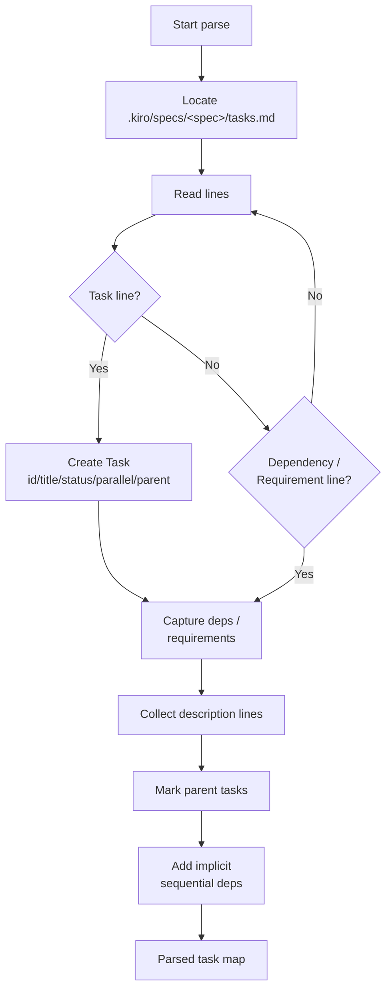
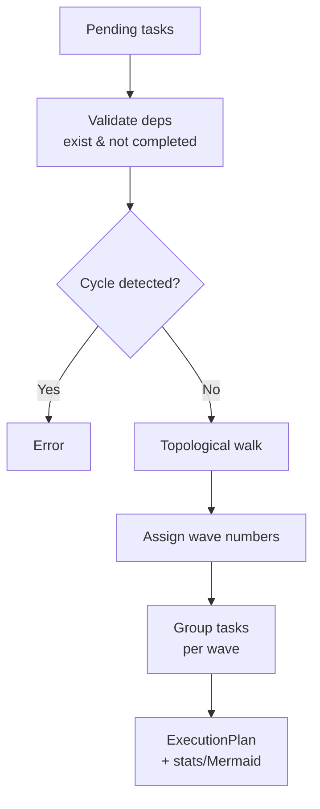
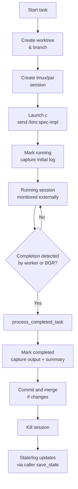
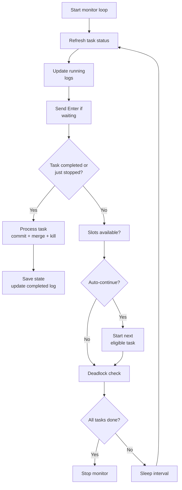
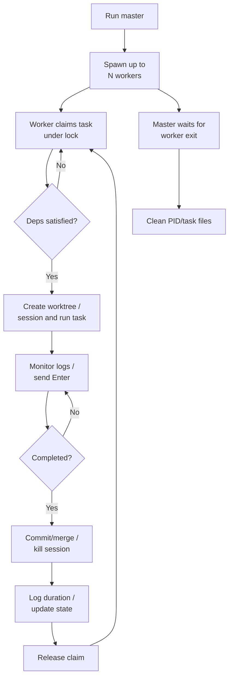

# kiro-parallel architecture

kiro-parallel is a parallel task orchestrator for cc-sdd specs. It reads `tasks.md`, builds dependency-aware waves, and spins up tmux/par sessions plus git worktrees to execute `/kiro:spec-impl <spec> <task>` concurrently while logging and auto-processing results.

## System architecture
- **Task ingestion**: `TasksParser` locates `.kiro/specs/<spec>/tasks.md`, parses hierarchical task IDs, titles, completion marks, descriptions, dependencies, requirements, and `(P)` parallel markers. Parent tasks are flagged (`is_parent_task`) and subtasks gain implicit sequential dependencies when not marked parallel.
- **Planning**: `DependencyAnalyzer` validates references, prunes dependencies already completed, detects cycles, and assigns each pending task to an execution wave via a topological walk. `print_analysis` reports counts, waves, and optional Mermaid output.
- **Execution engine**: `ParallelExecutor` owns per-spec state at `.kiro/specs/<spec>/.parallel_state.json`, log dir `logs/`, and git worktrees under `../worktrees/<spec>/task-<id>`. It can drive either `par` or raw tmux. For each task it:
  - Creates a dedicated worktree/branch (`task-<spec>-<id>`), tmux/par session (`<spec>-task-<id>`), and launches `c` then `/kiro:spec-impl`.
  - Tracks status, start time, running session names, and exposes `save_state/load_state` hooks used by workers/monitors to avoid duplicate starts.
  - Captures scrollback, extracts token/time summaries, and writes `task-<id>_latest.log` (plus timestamped archives).
  - On completion (`process_completed_task`), marks completed, captures output, attempts commit + merge to `main`, and kills the session; worktree cleanup happens via `clean` or a new start.
- **Background monitor**: `BackgroundLogRefresher` optionally runs in-process to refresh logs, auto-send Enter on waiting prompts, auto-process completed tasks, and auto-continue when slots open. It detects deadlocks (pending tasks blocked by failed/stopped deps) and stops when all work is finished.
- **Master/worker BGR**: A detached master (`kiro_parallel.py master`) spawns up to `MAX_WORKERS` detached worker processes. Coordination artifacts live under `.kiro/specs/<spec>/`:
  - Master PID `.master.pid`; per-worker PID `.worker-<id>.pid`; claimed task `.worker-<id>.task`; lock `.task_lock`; recent completions `.completed_tasks.json`.
  - Workers claim tasks atomically via file locking (`claim_next_task`), skipping parent headers and already-running or dependency-blocked tasks. They can also adopt orphaned sessions (`claim_running_task`) or reset stale running tasks without sessions.
  - Each worker starts/monitors a single task: create worktree/session, send commands, periodically capture logs, auto-enter, detect completion, then process (commit/merge/kill), log duration, save state, and release the claim.
  - Master simply waits for worker exits and cleans PID/task files when workers end. `stop-all` kills master/workers and lingering sessions; `clean` removes sessions/worktrees/state.
- **Commands**: The CLI exposes `analyze`, `run`, `status`, `clean`, `watch` (display-only), `monitor` (background log refresher without starting tasks), `stop` (task + worker), `recover` (orphaned sessions), `stop-all`, and `master-status` for health checks.

### Mermaid workflows (per function)

**Task ingestion (`TasksParser`)**

**Planning (`DependencyAnalyzer`)**

**Execution engine (`ParallelExecutor`)**

**Background monitor (`BackgroundLogRefresher`)**

**Master/worker background runners**

## Application workflow
1) **Analyze**: `kiro-parallel analyze <spec>` parses tasks, resolves dependencies, builds waves, and optionally renders Mermaid to inspect ordering/parallelism.
2) **Start execution**: `kiro-parallel run <spec> [--max-parallel N] [--wave M]` recovers orphaned sessions, then starts the master (unless already running). Master spawns up to `N` workers; optional watch mode renders live status.
3) **Task claiming**: Each worker grabs the next eligible pending task (dependency-satisfied, not already claimed/running, not a parent header) under file lock, or resumes an unclaimed running session.
4) **Task execution**: Worker creates a worktree + session, launches `c`, sends `/kiro:spec-impl <spec> <task>`, marks status running, and begins periodic monitoring.
5) **Monitoring & completion**: Workers and/or the background refresher capture logs, auto-press Enter on prompts, detect completion markers/idle prompt, then commit/merge to `main`, archive logs, kill the session, log duration to `.completed_tasks.json`, update saved state, and release the claim. Auto-continue can immediately start the next eligible task when capacity is available.
6) **Status & watching**: `status` replays saved state; `watch` is display-only and safe alongside the BGR; `master-status` reports master/worker PIDs and recent completions.
7) **Cleanup & recovery**: `stop` ends a specific task/worker; `stop-all` halts master/workers and kills sessions; `recover` reattaches orphaned sessions to state. `clean` removes sessions, worktrees, saved state, and completed-task logs once execution is finished.

Typical usage: inspect with `analyze`, run with `run --max-parallel <N>`, observe via `watch --auto-continue` or `master-status`, and clean up with `stop-all` + `clean` when done.
